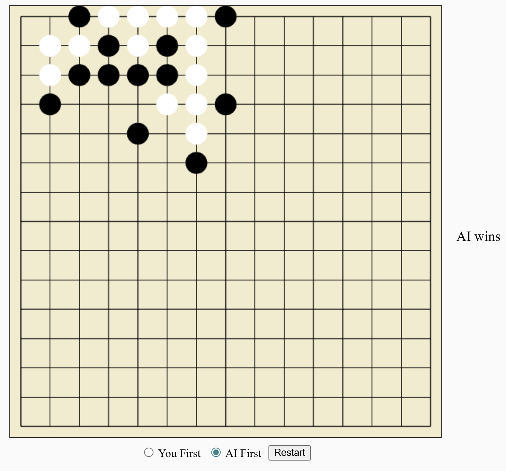

# Gomoku Game in Rust



This repository contains a simple console implementation of the Gomoku board game in Rust along with a lightweight WebGL interface for playing in the browser.

## Features

- **Console Interface**: Text-based gameplay with a clear board display.
- **Human vs. AI**: Choose whether the AI plays Black or White.
- **Minimax AI**: AI uses Minimax with alpha-beta pruning (depth 3) for strategic moves.
- **Win/Draw Detection**: Detects wins (five in a row) or draws (full board).
- **Input Validation**: Ensures valid moves with error messages for invalid inputs.
- **WebGL UI**: Play directly in the browser using the files in the `web` folder. All game logic runs in Rust and is compiled to WebAssembly.

## Prerequisites

- [Rust](https://www.rust-lang.org/tools/install) (stable version recommended)
- Cargo (included with Rust)

## Installation

1. Clone the repository:
   ```bash
   git clone https://github.com/<your-username>/gomoku.git
   cd gomoku
   ```
2. Run the console version:
   ```bash
   cargo run
   ```
   The program will ask if you want to move first. Moving first means you
   play Black (X); otherwise the AI takes the Black stones and you play
   White (O).
3. Build the WebGL interface using [wasm-pack](https://rustwasm.github.io/wasm-pack/):
   ```bash
   wasm-pack build --target web
   ```
   This compiles the Rust game logic to WebAssembly and writes bindings in the `pkg/` directory.
4. Serve the `web/` folder with any static file server, e.g. on Linux:
   ```bash
   cd web
   python3 -m http.server 8000
   ```
   Then open `http://localhost:8000` in your browser to play.
